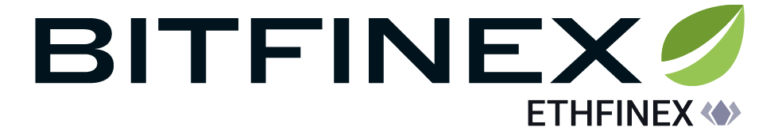

# Bitfinex websocket API version 2.0 client [](https://travis-ci.org/Marfusios/bitfinex-client-websocket) [](https://badge.fury.io/nu/Bitfinex.Client.Websocket)

This is a C# implementation of the Bitfinex websocket API version 2.0 (BETA) found here:

https://bitfinex.readme.io/v2/docs

### License: 
    Apache License 2.0

### Features

* instalation via NuGet ([Bitfinex.Client.Websocket](https://www.nuget.org/packages/Bitfinex.Client.Websocket))
* public and authenticated API
* targeting .NET Standard 2.0 (.NET Core, Linux/MacOS compatible)
* reactive extensions ([Rx.NET](https://github.com/Reactive-Extensions/Rx.NET))
* integrated logging ([Serilog](https://serilog.net/))

### Usage

```csharp
var exitEvent = new ManualResetEvent(false);
var url = BitfinexValues.ApiWebsocketUrl;

using (var communicator = new BitfinexWebsocketCommunicator(url))
{
    using (var client = new BitfinexWebsocketClient(communicator))
    {
        client.Streams.InfoStream.Subscribe(info =>
        {
            Log.Information($"Info received, reconnection happened, resubscribing to streams");
            
            await client.Send(new PingRequest() {Cid = 123456});
            //await client.Send(new TickerSubscribeRequest("BTC/USD"));
        });

        client.Streams.PongStream.Subscribe(pong =>
        {
            Console.WriteLine($"Pong received! Id: {pong.Cid}") // Pong received! Id: 123456
            exitEvent.Set();
        });

        await communicator.Start();

        exitEvent.WaitOne(TimeSpan.FromSeconds(30));
    }
}
```

More usage examples:
* integration tests ([link](test_integration/Bitfinex.Client.Websocket.Tests.Integration))
* console sample ([link](test_integration/Bitfinex.Client.Websocket.Sample/Program.cs))

### API coverage

| PUBLIC                 |    Covered     |  
|------------------------|:--------------:|
| Info                   |  ✔            |
| Ping-Pong              |  ✔            |
| Errors                 |  ✔            |
| Channel subscribing    |  ✔            |
| Channel unsubscribing  |  ✔            |
| Ticker                 |  ✔            |
| Trades                 |  ✔            |
| Books                  |  ✔            |
| Raw books              |                |
| Candles                |  ✔            |

| AUTHENTICATED          |    Covered     |  
|------------------------|:--------------:|
| Account info           |  ✔            |
| Orders                 |  ✔            |
| Positions              |                |
| Trades                 |                |
| Funding                |                |
| Wallets                |  ✔            |
| Balance                |                |
| Notifications          |                |

| AUTHENTICATED - INPUT  |    Covered     |  
|------------------------|:--------------:|
| New order              |  ✔            |
| Cancel order           |  ✔            |
| Cancel order multi     |                |
| Calc                   |                |

**Pull Requests are welcome!**

### Available for help
I do consulting, please don't hesitate to contact me if you have a custom solution you would like me to implement ([web](http://mkotas.cz/), 
<m@mkotas.cz>)

Donations gratefully accepted.
* [](https://en.cryptobadges.io/donate/1HfxKZhvm68qK3gE8bJAdDBWkcZ2AFs9pw)
* [](https://en.cryptobadges.io/donate/LftdENE8DTbLpV6RZLKLdzYzVU82E6dz4W)
* [](https://en.cryptobadges.io/donate/0xb9637c56b307f24372cdcebd208c0679d4e48a47)